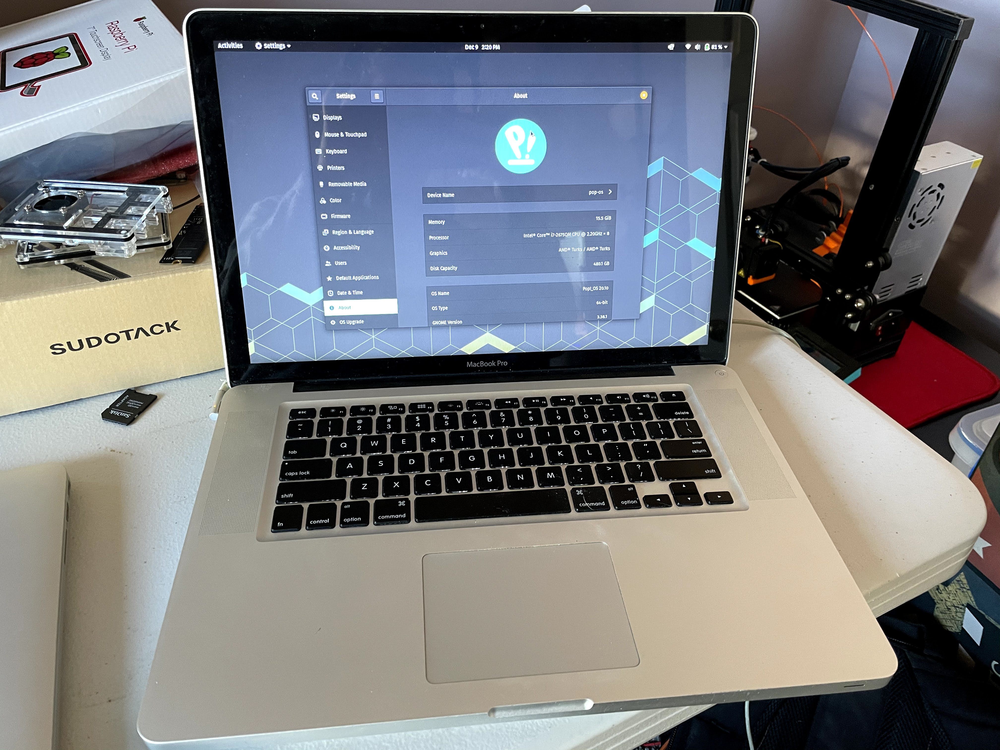

In 2012 I got my first MacBook Pro. At the time, I was majoring in film, and anyone who didn't use a Mac to create digital media was frowned upon. Until that point, I was very anti-Apple. This was the beginning of that changing. Almost 10 years later and this machine is still kicking. It has followed me across multiple continents, produced feature length films, built apps for multiple clients, and, although the GPU died under warranty a few times, it still runs _fairly_ well.

The last macOS version this machine will run was 10.13.6 High Sierra. At the time of this writing, it got a security update 40 days ago, but there are so many things you are missing out on. Yes you can use third party tools like Catalina Patcher to run more modern versions, but that requries disabling hardware acceleration and will render the machine almost useless. So how does a machine like this finally die? Well, it's when Apple no longer provides updates...
Or does it?

### Enter Linux

> Wait Linux? Isn't that like a really advanced operating system? I hear its hard to use...

Well 20 years ago you would be correct. These days many variants of Linux come with a lot of polish, and a really easy to use interface. A lot come with something similar to an "App Store" where you can search for software you want to install. You can also go to most websites and download a version of your favorite software, same as if you were on Windows or macOS.

Traditionally, it has been difficult to get linux running on a mac, but lets give it a shot anyway. I have had good luck with a version called Pop!_OS in the past, so lets try that.

Lets head over to the [Pop!_OS](https://pop.system76.com/) website. Click on Download. At the time of writing, Pop!_OS 20.10 is the latest version, so lets use that. My mac doesn't have an NVIDIA card in it, so I will use the normal version. Lets click on Download 20.10.

This will download an `iso` file, which is a disk image format. Next we will need a tool to write that onto a USB Drive. (I recommend one that is at least 8GBG in size, but for this I had a 32GB laying around that I used.) - My tool of choice is called [balenaEtcher](https://www.balena.io/etcher/). You can download it from their website.

Alternatively if you have homebrew installed, you can run the following command.

```sh
$ brew install balenaetcher
```

Plug in your USB drive, and open up balenaEtcher.

**Warning: The following steps will erase everything on your USB drive. Make sure to backup any important files.**

Select the iso file from where it was saved. next point balenaEtcher to your USB drive, and then hit flash. It will ask you for your password, and possibly ask permission to access the USB drive. This is normal. The flash will take a moment or two so grab a coffee or a tea and sip on that.

Assuming the flash finished successfully, congrats! You can unplug your USB drive.

Now here is where the fun part starts. First, **make sure you backup any important files.** You won't be able to restore from a time-machine backup once you have Linux installed. **This process will also erase everything on your mac.** In my case, I didn't have anything I needed to keep around.

Shut down your mac and plug-in the USB drive we flashed. Next, press the power button while holding down the `Option` key. Keep holding it down until you see a list of drives show up. One of them should say EFI Boot. Use the arrow key to select that one and hit `enter`.

Next, you will see a boot screen with a countdown. You can either hit enter, or wait 10 seconds. It doesn't matter which you do. After this you will see a lot of text scroll across your screen. Don't worry about this. After about a minute you should be booted into an install screen with a robot wanting you to select your language. In my case I use English so I will press the `Select` button at the bottom right of my screen. It also wants to know what country I am in, so I select that and continue.

If you use a non-standard keyboard, you can select that layout now, and test it out. My keyboard is standard US so I will continue past this screen.

Next we are asked how we want to install Pop!_OS. In my case I want to do a clean install, so I will select that. It also wants to know what drive I want to install on. I only have one in my mac, so I select it.

**The next step will erase everything on your computer. This cannot be reversed.**

I then click `Erase and Install`.

Pop!\_OS comes with drive encryption. I will always recommend you use this, but it's up to you. I'll enter my password I want to use and continue. Pop!\_OS will now install itself. This will take a few minutes, so lets get another coffee.


Pop!\_OS has finished installing and is asking us if we want to restart or shut-down. I'll choose shut-down in my case. Once the system is shut-down, I'll remove the USB Drive and power back on the mac.

Since I selected an encrypted disk, I am asked to enter my password. Type that in and press `enter`.

Look at that! Pop!\_OS is welcoming me. Follow the wizard and instructions on screen to setup your user account the way you like it. Once you have finished that, we have one more step we have to do.

Everything looks like its working, but in my case the WiFi card was not working. This is an easy fix, but we will have to plug in to a LAN cable to fix it. Once you are plugged in, go to `Activities` and search for PoP!\_Shop. Open that and go to the `Installed` tab. You should see a drivers package labeled `bcmwl-kernel-source`. Install that. Once it is installed you can unplug the LAN cable. Click in the top-right corner of your screen and you can restart your computer. Once it is booted back up you can click in the top-right and join your wifi.

This worked for me, and gave my mac a new lease on life! Hopefully this helps you! If you ever wish to learn more about Pop!\_OS you can head to their [website](https://pop.system76.com/) which is full of useful tips, tricks, and documentation.

EDIT: A few last minute items I want to add. First a friend reached out and asked if other hardware like the webcam, bluetooth, audio, and external display work. I can say confidently that they work great! Next, I think its worth pointing out that you can pickup a pre-owned mac like the one I have on [ebay](https://www.ebay.com/sch/i.html?_from=R40&_trksid=p2380057.m570.l1313&_nkw=2011+macbook+pro&_sacat=0) for anywhere from $50-$200 USD, so if you are looking for a cheap laptop this is a great option!



